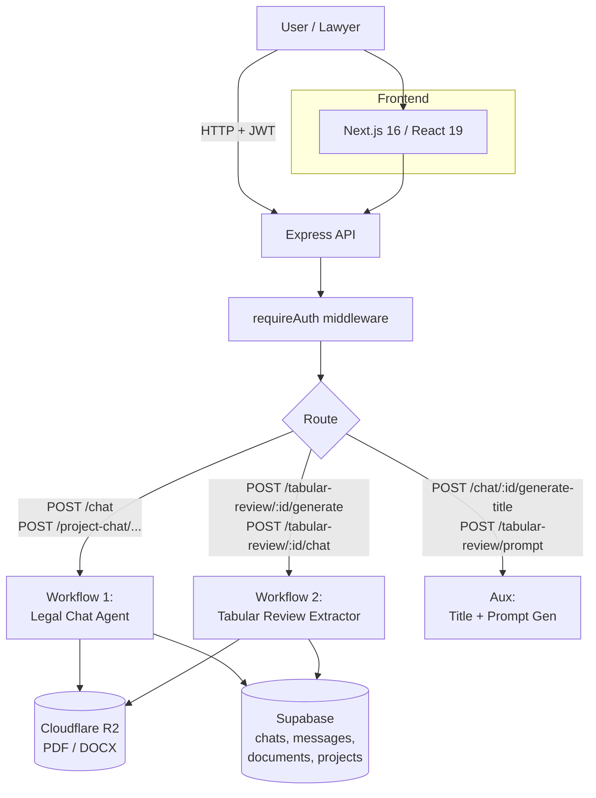
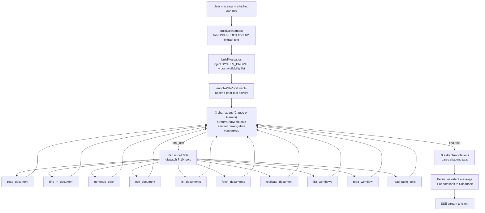
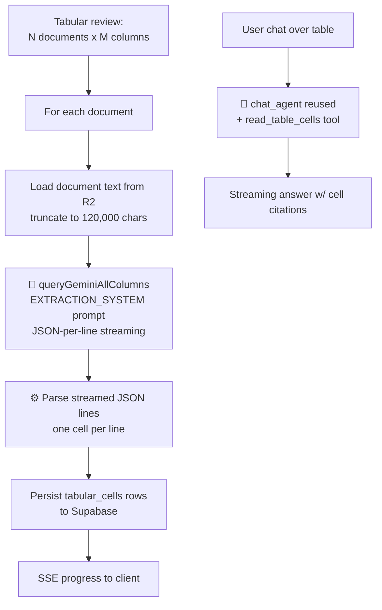

# PRD — Mike: AI Legal Assistant

Generated: 2026-05-04
Mode: adapt (reverse-engineered from existing codebase)

---

## 1. Pipeline Purpose

Mike is a full-stack AI legal assistant for lawyers and legal professionals. It enables users to:

- Upload legal documents (PDF, DOCX, legacy DOC) and have an LLM read, cite, and reason over them.
- Chat conversationally with an agent that can call tools to read documents, search within them, generate new Word documents, and propose tracked-change edits to existing DOCX files.
- Run structured "tabular reviews" — extract specific fields from a set of documents into a spreadsheet-like grid (e.g., extract "governing law", "termination clause", "indemnification cap" from a folder of 50 contracts).
- Author and share custom legal workflows (long structured prompts) such as "Generate CP Checklist", "Credit Agreement Summary", "Shareholder Agreement Summary".
- Collaborate via shared projects and shared reviews, scoped by Supabase RLS plus an application-layer access layer.

The product solves the problem of legal due diligence at scale — instead of a paralegal manually skimming hundreds of contracts, Mike loads document text on-demand into an LLM's context window and lets the lawyer ask high-precision questions or run reusable extraction templates.

---

## 2. Pipeline Architecture

There are **two distinct LLM-driven workflows**, both implemented in the TypeScript Express backend.

### Mermaid — High-level system



### Workflow 1 — Legal Chat Agent (primary, agentic)

Entry points:
- `backend/src/routes/chat.ts` → `POST /chat` (single-doc chat)
- `backend/src/routes/projectChat.ts` → `POST /project-chat/:projectId` (project-scoped chat)

Both delegate to `runLLMStream` in `backend/src/lib/chatTools.ts`.



**Node table — Workflow 1**

| Node ID | Type | Description | Inputs | Outputs |
|---|---|---|---|---|
| `build_doc_context` | code | Loads documents from R2, extracts text from PDFs/DOCX, assigns `doc-N` labels | `attachmentIds`, `userId`, `projectId?` | `docStore`, `docIndex` |
| `build_messages` | code | Constructs message array with system prompt + doc availability list + chat history | `docIndex`, `chatHistory`, `userMessage` | `LlmMessage[]` |
| `enrich_with_prior_events` | code | Appends summary of prior tool calls to last assistant message for continuity | `LlmMessage[]`, `priorEvents` | `LlmMessage[]` |
| `chat_agent` | agentic | The core multi-turn tool-use loop; up to 10 iterations of LLM call → tool execution | `LlmMessage[]`, `tools`, `model` | streaming text + tool calls |
| `run_tool_calls` | code | Dispatches each tool name to its server-side implementation | `NormalizedToolCall[]` | `NormalizedToolResult[]` |
| `extract_annotations` | code | Parses `<doc-N>` style citation tags from final assistant text into structured annotations | `assistantText`, `docIndex` | `annotations[]` |

### Workflow 2 — Tabular Review Extractor (batch + chat)

Entry points:
- `backend/src/routes/tabular.ts` → `POST /tabular-review/:reviewId/generate` (batch extraction)
- `backend/src/routes/tabular.ts` → `POST /tabular-review/:reviewId/chat` (chat over the resulting table; reuses `runLLMStream` with `read_table_cells` tool)



**Node table — Workflow 2**

| Node ID | Type | Description | Inputs | Outputs |
|---|---|---|---|---|
| `load_document_text` | code | Pulls one DOCX/PDF from R2 and extracts text, truncated at 120k chars | `documentId` | `documentText`, `filename` |
| `extraction_agent` | llm | Single-shot LLM call per document with all column prompts; returns one JSON line per column | `documentText`, `columnPrompts`, `EXTRACTION_SYSTEM` | streamed JSON cells |
| `parse_cells` | code | Parses each streamed JSON line into a structured cell `{value, citation, confidence}` | streamed JSON | `cell` rows |
| `persist_cells` | code | Inserts cells to `tabular_cells` table in Supabase | `cells`, `reviewId` | DB rows |
| `tabular_chat_agent` | agentic | Reuses `runLLMStream` with `read_table_cells` tool to answer questions about the populated table | user message, `reviewId` | streaming response |

### Auxiliary LLM uses (not separate workflows)

- **Title generation** (`POST /chat/:chatId/generate-title`) — single low-tier LLM call (Haiku / Gemini Flash Lite) to produce a chat title from the first user message.
- **Column prompt generation** (`POST /tabular-review/prompt`) — single low-tier LLM call to expand a short column label like "Governing Law" into a full extraction prompt.

These are simple completions; they are surfaced in `scan-result.json` via the auxiliary node `title_gen` for completeness but are not the optimization target.

---

## 3. LLM Configuration

| Tier | Models | Default | Used by |
|---|---|---|---|
| main-chat | claude-opus-4-7, claude-sonnet-4-6, gemini-3.1-pro-preview, gemini-3-flash-preview | gemini-3-flash-preview | Workflow 1 (chat_agent) |
| mid-tier | claude-sonnet-4-6, gemini-3-flash-preview | gemini-3-flash-preview | Workflow 2 (extraction_agent) |
| low-tier | claude-haiku-4-5, gemini-3.1-flash-lite-preview | gemini-3.1-flash-lite-preview | title_gen, column-prompt-gen |

Per-call settings:
- Workflow 1 (`streamClaude` / `streamGemini`): max_tokens 16384, `enableThinking=true` always on, temperature omitted when thinking is enabled (Claude API requirement), `thinkingBudget=0` when disabled (Gemini), up to 10 tool-use iterations.
- Workflow 2 extraction: max_tokens 2048 per cell, streaming JSON-per-line.
- Auxiliary: max_tokens 512, single-shot non-streaming.

User-supplied API keys are read from `user_profiles.claude_api_key` / `user_profiles.gemini_api_key` (stored as plaintext — see security notes in exploration report).

---

## 4. Prompt Inventory

| Prompt ID | Location | Purpose | Length |
|---|---|---|---|
| `SYSTEM_PROMPT` | `backend/src/lib/chatTools.ts` | Master legal-assistant system prompt — citation format, docx generation rules, workflow rules | ~1,500 chars |
| Tool schemas (10) | `backend/src/lib/chatTools.ts` | OpenAI-style JSON-schema descriptions for all tools | ~2,000 chars total |
| Doc availability injection | `buildMessages` in `chatTools.ts` | Lists `doc-N → filename` mapping appended to system context per turn | dynamic |
| Prior events enrichment | `enrichWithPriorEvents` in `chatTools.ts` | Summary of previously executed tool calls appended to last assistant turn | dynamic |
| `EXTRACTION_SYSTEM` | `backend/src/routes/tabular.ts` | Legal analyst persona for cell extraction; instructs JSON output | ~400 chars |
| Built-in workflows (3) | `backend/src/lib/builtinWorkflows.ts` | "Generate CP Checklist", "Credit Agreement Summary", "Shareholder Agreement Summary" — long structured prompts | ~1,500–3,000 chars each |
| User-defined workflows | `workflows` table in Supabase | Free-form prompt_md authored by users | variable |
| Title-gen prompt | inline in `routes/chat.ts` | Generates a 5–8 word chat title from first user message | ~200 chars |
| Column prompt-gen | `routes/tabular.ts` | Expands a column label into an extraction prompt | ~300 chars |

---

## 5. Metrics

**No automated evaluation harness exists today.** There is no `evaluate.py`, no benchmark suite, no labeled dataset, no metric tracker. Quality is judged ad-hoc by users.

For optimization, candidate metrics are:
- **Citation accuracy** — does each `<doc-N>` reference map to a real passage that supports the claim?
- **Tool-call efficiency** — number of tool calls per response (lower is better, subject to answer quality).
- **Extraction precision/recall** — for tabular reviews, agreement of extracted cells vs. a human-graded gold set.
- **Tracked-change correctness** — for `edit_document`, does the proposed redline accurately implement the user's instruction without breaking the underlying DOCX XML?
- **Latency** — end-to-end response time, especially for the 10-iteration tool loop.
- **Refusal / hallucination rate** — does the agent refuse to answer when documents lack the information vs. fabricating citations?

Targets must be set via the data-synthesis pipeline (no labels exist).

---

## 6. Data Sources

| Source | Type | Loading method |
|---|---|---|
| User-uploaded PDF / DOCX / DOC | Cloudflare R2 (S3-compatible) | `backend/src/lib/storage.ts` → `downloadFile(key)` |
| Document text extraction | In-memory parsing | `pdf-parse` for PDF, `jszip` + custom XML parser for DOCX (in `chatTools.ts`) |
| Conversation history | Supabase Postgres | `messages` table, loaded per chat |
| Tabular cells | Supabase Postgres | `tabular_cells` table |
| Workflows | Supabase Postgres + `builtinWorkflows.ts` | `workflows` table + 3 hard-coded |
| User settings (API keys, model prefs) | Supabase Postgres | `user_profiles` table via `userSettings.ts` |

**No training or evaluation dataset exists.** No `.jsonl`, `.csv`, or labeled corpora anywhere in the repo. For the MEGA optimization pipeline, data must be **synthesized** (e.g., generated legal documents + adversarial questions + gold answers).

---

## 7. I/O Overview

### End-Input — Workflow 1 (Legal Chat)

`POST /chat` request body:

```json
{
  "chatId": "uuid-of-chat",
  "message": "What is the governing law in the NDA?",
  "attachments": ["doc-uuid-1", "doc-uuid-2"],
  "model": "claude-sonnet-4-6",
  "workflowId": null
}
```

| Field | Type | Description |
|---|---|---|
| `chatId` | string (uuid) | Existing chat; new chats POST to a separate create endpoint first |
| `message` | string | The user's natural-language question or instruction |
| `attachments` | string[] | Document UUIDs the user wants the LLM to be able to read this turn |
| `model` | string | One of `ALL_MODELS`; validated against the allowlist |
| `workflowId` | string \| null | If set, the workflow's `prompt_md` is injected as a tool result before the user message |

### End-Output — Workflow 1

Server-Sent Events stream; final assistant message persisted to `messages` table:

```json
{
  "id": "msg-uuid",
  "chatId": "uuid-of-chat",
  "role": "assistant",
  "content": "The governing law is New York <doc-1 page=\"3\">Section 12.1</doc-1>.",
  "annotations": [
    {
      "docId": "doc-uuid-1",
      "label": "doc-1",
      "page": 3,
      "snippet": "Section 12.1"
    }
  ],
  "toolEvents": [
    { "name": "read_document", "args": { "doc": "doc-1" }, "result": "..." }
  ],
  "createdAt": "2026-05-04T15:42:39Z"
}
```

### End-Input — Workflow 2 (Tabular Generate)

`POST /tabular-review/:reviewId/generate` request body:

```json
{
  "documentIds": ["doc-uuid-1", "doc-uuid-2", "doc-uuid-3"],
  "columnIds": ["col-1", "col-2"]
}
```

Each column is pre-defined in the `tabular_columns` table with `{ label, prompt_md, format }`.

### End-Output — Workflow 2

Server-Sent Events; final cells persisted to `tabular_cells`:

```json
{
  "reviewId": "review-uuid",
  "documentId": "doc-uuid-1",
  "columnId": "col-1",
  "value": "New York",
  "citation": { "page": 3, "quote": "This Agreement shall be governed by the laws of the State of New York." },
  "confidence": 0.92,
  "status": "ready"
}
```

### Document Store (background reference data)

Loaded on-demand per turn — not pre-indexed:

```json
{
  "doc-1": {
    "id": "doc-uuid-1",
    "filename": "NDA_signed.pdf",
    "mimeType": "application/pdf",
    "extractedText": "MUTUAL NON-DISCLOSURE AGREEMENT\nThis Agreement ...",
    "r2Key": "documents/{userId}/{docId}/original.pdf",
    "version": 1
  }
}
```

The store is built per request by `buildDocContext(attachmentIds, userId)` (single-doc chat) or by loading all project documents (project chat). Truncation: 120,000 chars per document for tabular extraction; full text for chat.

**No vector store, no RAG, no embeddings.** Documents are injected as plain text into the LLM context window each turn.

---

## 8. Optimizable Elements

### Prompts (LLM nodes)
- `SYSTEM_PROMPT` (Workflow 1) — single largest lever; controls citation behavior, tool-use discipline, refusal behavior.
- `EXTRACTION_SYSTEM` (Workflow 2) — controls JSON output strictness, hallucination rate.
- Tool schema descriptions (10 tools) — wording of `description` field shapes when the LLM picks each tool.
- Built-in workflow prompts (3) — externalized but fixed templates.
- Doc availability list format — currently `doc-N → filename`; could include short summary or page count.
- Prior-events enrichment format — summary granularity affects context bloat.

### LLM parameters
- Model selection per tier (4 main, 2 mid, 2 low).
- `enableThinking` flag — currently always on for Workflow 1; could be conditional on query complexity.
- `maxIter=10` for the tool-use loop — could be adaptive.
- `max_tokens=16384` — could be lower for short answers.
- Temperature — omitted when thinking is on; could be tuned when off.
- 120,000-char truncation for tabular extraction — could chunk-and-merge instead of truncate.

### Code logic (Code nodes)
- `extractAnnotations` parsing — currently regex-based; could be made tolerant to LLM citation drift.
- `buildDocContext` — caching of extracted text across turns.
- `enrichWithPriorEvents` — currently appends full tool args/results; could summarize.
- `runToolCalls` dispatch — could parallelize independent tool calls.
- `buildMessages` — chat history truncation strategy.

### Pipeline structure
- **Add a retrieval/RAG node** — currently every doc is fully loaded; embedding-based passage retrieval would reduce context tokens dramatically.
- **Add a planning node before the agent loop** — a cheap planner LLM could pre-decide which tools and which docs to load, then the main agent executes the plan.
- **Promote `parse_cells` (code) to an LLM repair node** — when JSON parsing fails, fall back to an LLM repair step instead of dropping the cell.
- **Split `chat_agent` into intent classifier + executor** — different prompts for "answer", "draft", "edit" flows.

---

## 9. Metrics & Targets (placeholder)

No explicit numeric target was specified by the user. `targetAccuracy` is left null in `project.json`.

When data is synthesized in the next phase, candidate primary metrics (in priority order):
1. Citation grounding rate (assistant cites a real passage that supports its claim).
2. Tabular extraction F1 vs. gold set.
3. Tool-call count per resolved query (efficiency).

---

## 10. Notes for the Builder Agents

- **Languages:** TypeScript (backend Express on Node, frontend Next.js). No Python in the runtime path.
- **Data status:** synthesized — no labeled data exists; the data-worker must generate legal documents + Q/A pairs.
- **Multi-turn:** yes; preserve `chats` + `messages` schema fidelity when synthesizing.
- **Tool use:** yes; 10 tools must be representable in any evaluation harness.
- **RAG:** no; documents flow through context window directly.
- **HTML / SQL / shell output:** none; output is markdown text + structured citations.
- **Primary optimization target:** Workflow 1 (Legal Chat Agent) — it is the user-facing surface and contains the largest, most levered prompt.
